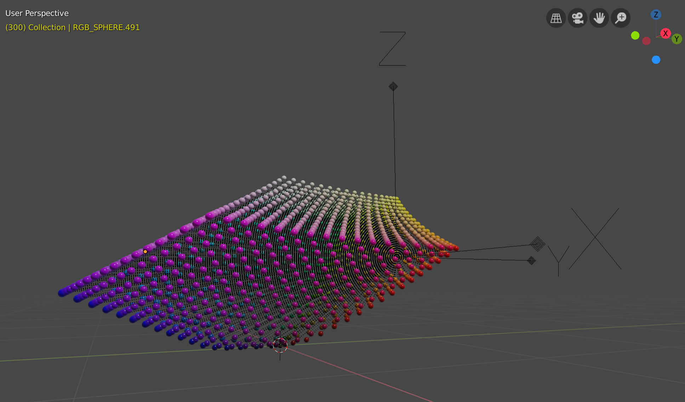
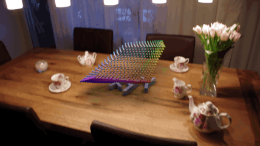

# RGBCube
Blender addon which creates an RGB cube which transforms into an L\*a\*b* colour space.

## Usage

* Launch [Blender](https://www.blender.org/) (minimum version 2.8)
* Switch to Scripting workspace
* Create a new text
* Copy the content of [sRGB2Lab.py](https://github.com/till213/RGBCube/blob/master/src/sRGB2Lab.py) into the newly created text
* Run it as script: Run Script (ALT + P)

## TODOs

* Make it a proper addon, such that it can be invoced via mesh generator menu
* Use node-based materials
* Make variable properties

## Example

The following animation snippet was done using Blender and its camera tracking feature.

