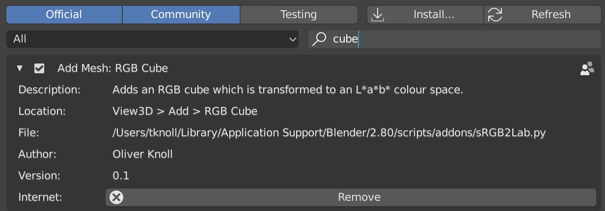
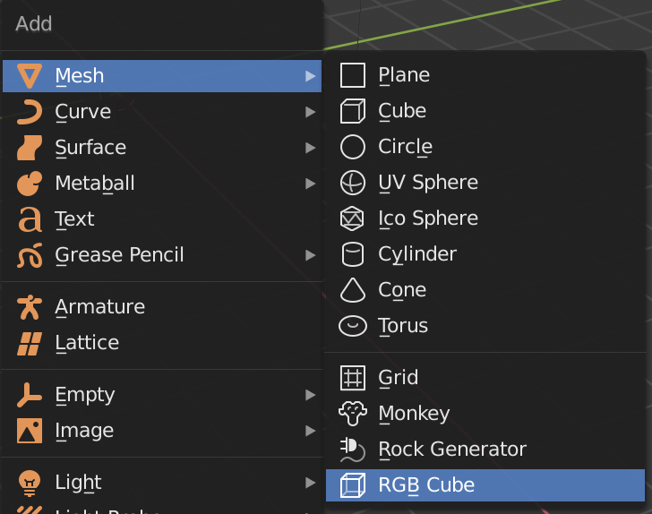
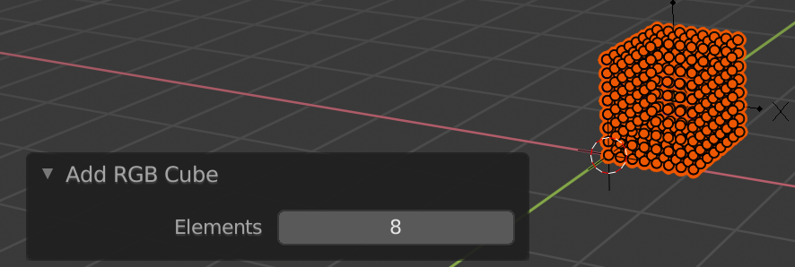

# RGBCube
Blender add-on which creates an RGB cube which is then transformed into an L\*a\*b* colour space (via linear RGB and XYZ colour spaces).

## Installation

Install the Blender add-on as follows:

* Launch [Blender](https://www.blender.org/) (minimum version 2.8)
* *Edit -> Preferences* (On macOS: CMD + ,)
* Click on *Install...*
* Navigate to the checked out file [sRGB2Lab.py](https://github.com/till213/RGBCube/blob/master/src/sRGB2Lab.py) and click on *Install Add-on from File...*
* Make sure the newly installed add-on is *enabled*
* Optionally click on *Save Preferences* (button on bottom left)

## Usage

After installation of the add-on you can add the RGB cube mesh (with animation key frames) as follows:

* Switch to e.g. *Modeling* workspace
* Add a new object (SHIFT + A)
* Select *Mesh -> RGB Cube*

* Change the number of elements per edge, if required

## TODOs

* Use node-based materials
* Make variable properties

## Example

The following animation snippet was done using Blender and its camera tracking feature.

